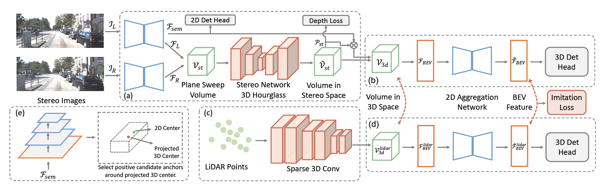

# LIGA-Stereo

## Introduction

This is the official implementation of the paper LIGA-Stereo: Learning LiDAR Geometry Aware Representations for Stereo-based 3D Detector, In ICCV'21, Xiaoyang Guo, Shaoshuai Shi, Xiaogang Wang and Hongsheng Li.

[[project page]](https://xy-guo.github.io/liga/) 
[[paper]](https://xy-guo.github.io/liga/liga-guo-iccv21.pdf) 
[[code]](https://github.com/xy-guo/LIGA-Stereo)




## Overview
- [Installation](#installation)
- [Getting Started](#getting-started)
- [Pretrained Models](#pretrained-models)
- [Citation](#citation)


## Installation

### Requirements
All the codes are tested in the following environment:
* Linux (tested on Ubuntu 14.04 / 16.04)
* Python 3.7
* PyTorch 1.6.0
* Torchvision 0.7.0
* CUDA 9.2 / 10.1
* [`spconv (commit f22dd9)`](https://github.com/traveller59/spconv)


### Installation Steps

a. Clone this repository.
```shell
git clone https://github.com/xy-guo/LIGA.git
```

b. Install the dependent libraries as follows:

* Install the dependent python libraries: 
```shell
pip install -r requirements.txt 
```

* Install the SparseConv library, we use the implementation from [`[spconv]`](https://github.com/traveller59/spconv). 

```shell
git clone https://github.com/traveller59/spconv
git reset --hard f22dd9
git submodule update --recursive
python setup.py bdist_wheel
pip install ./dist/spconv-1.2.1-cp37-cp37m-linux_x86_64.whl
```

* Install modified mmdetection from [`[mmdetection_kitti]`](https://github.com/xy-guo/mmdetection_kitti)
```shell
git clone https://github.com/xy-guo/mmdetection_kitti
python setup.py develop
```

c. Install this library by running the following command:
```shell
python setup.py develop
```


## Getting Started
The dataset configs are located within [configs/stereo/dataset_configs](../configs/stereo/dataset_configs), 
and the model configs are located within [configs/stereo](../configs/stereo) for different datasets. 


### Dataset Preparation

Currently we only provide the dataloader of KITTI dataset.

* Please download the official [KITTI 3D object detection](http://www.cvlibs.net/datasets/kitti/eval_object.php?obj_benchmark=3d) dataset and organize the downloaded files as follows (the road planes are provided by OpenPCDet [[road plane]](https://drive.google.com/file/d/1d5mq0RXRnvHPVeKx6Q612z0YRO1t2wAp/view?usp=sharing), which are optional for training LiDAR models):

```
LIGA_PATH
├── data
│   ├── kitti
│   │   │── ImageSets
│   │   │── training
│   │   │   ├──calib & velodyne & label_2 & image_2 & (optional: planes)
│   │   │── testing
│   │   │   ├──calib & velodyne & image_2
├── configs
├── liga
├── tools
```

* You can also choose to link your KITTI dataset path by
```
YOUR_KITTI_DATA_PATH=~/data/kitti_object
ln -s $YOUR_KITTI_DATA_PATH/training/ ./data/kitti/
ln -s $YOUR_KITTI_DATA_PATH/testing/ ./data/kitti/
```

* Generate the data infos by running the following command: 
```python 
python -m liga.datasets.kitti.kitti_dataset create_kitti_infos
python -m liga.datasets.kitti.kitti_dataset create_gt_database_only
```

### Training & Testing


#### Test and evaluate the pretrained models

* To test with multiple GPUs:
```shell script
./scripts/dist_test_ckpt.sh ${NUM_GPUS} ./configs/stereo/kitti_models/liga.yaml ./ckpt/pretrained_liga.pth

```


#### Train a model  

* Train with multiple GPUs
```shell script
./scripts/dist_train.sh ${NUM_GPUS} 'exp_name' ./configs/stereo/kitti_models/liga.yaml

```

## Pretrained Models

[Google Drive](https://drive.google.com/file/d/1M97Wa2ehAdCD6rwEhe67Vde7y4fLtVXo/view?usp=sharing)

## Citation

```
@InProceedings{Guo_2021_ICCV,
    author = {Guo, Xiaoyang and Shi, Shaoshuai and Wang, Xiaogang and Li, Hongsheng},
    title = {LIGA-Stereo: Learning LiDAR Geometry Aware Representations for Stereo-based 3D Detector},
    booktitle = {Proceedings of the IEEE/CVF International Conference on Computer Vision (ICCV)},
    month = {October},
    year = {2021}
}
```

## Acknowledgements
Part of codes are migrated from [OpenPCDet](https://github.com/open-mmlab/OpenPCDet) and [DSGN](https://github.com/dvlab-research/DSGN).
